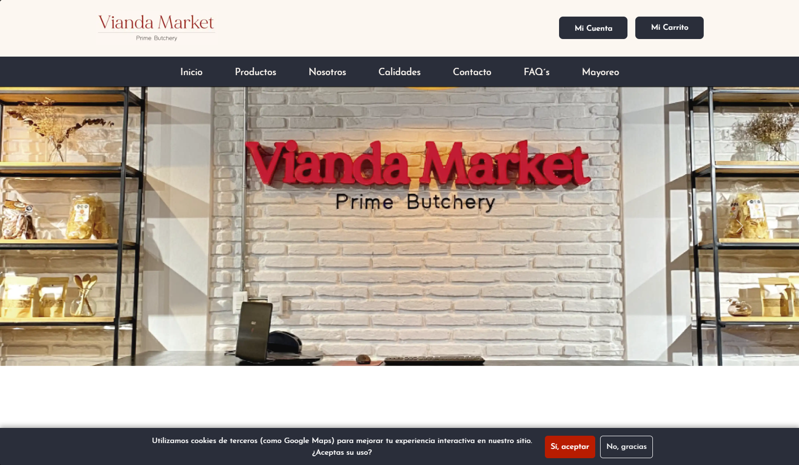

# Vianda Market 🥩

Vianda Market es una plataforma de e-commerce dedicada a la venta de cortes de carne y productos de alta calidad. Este repositorio contiene el desarrollo del **Frontend** y el panel de administración (Dashboard) del proyecto.

🔗 **[Visita el proyecto en vivo aquí](https://viandamarket-front-production.up.railway.app/)**

## 📸 Vista Previa

## ✨ Características Principales

El proyecto está diseñado para ofrecer una experiencia de compra completa y una gestión amigable:

- **🛍️ Catálogo y Tienda**: Exploración de productos, vistas de calidades de carne y página de detalles por producto.
- **🛒 Carrito de Compras y Checkout**: Gestión del carrito y pasarela de pago simulada (PayPal).
- **👤 Gestión de Usuarios**: Interfaz para registro, inicio de sesión y perfil del usuario.
- **📊 Dashboard de Administración**: Panel privado que incluye métricas de ventas, tráfico y un sistema CRUD para la gestión de productos y clientes.
- **📞 Páginas Informativas**: Preguntas Frecuentes (FAQ), formularios de contacto, sección de "Acerca de" y ventas por mayoreo.

## 🛠️ Tecnologías Utilizadas

- HTML5
- CSS3 (Estilos custom y diseño responsivo)
- JavaScript Vanilla (Manejo del DOM, peticiones, carrito de compras)

## 🚀 Ejecución Local

> **⚠️ Importante:** Para que la aplicación funcione correctamente en tu entorno local, primero debes configurar y ejecutar el código del backend. Puedes encontrarlo en el siguiente repositorio: **[GenMx-ViandaMarket-Back](https://github.com/Frangersal/GenMx-ViandaMarket-Back)**.

1. Clona este repositorio en tu máquina local.
2. Abre el proyecto en tu editor de código (como VS Code).
3. Configura el entorno local editando `assets/js/config.js`: comenta la línea 9 y descomenta la línea 6.
4. Inicia la aplicación abriendo el archivo `index.html` con un servidor local, como la extensión **Live Server**.
